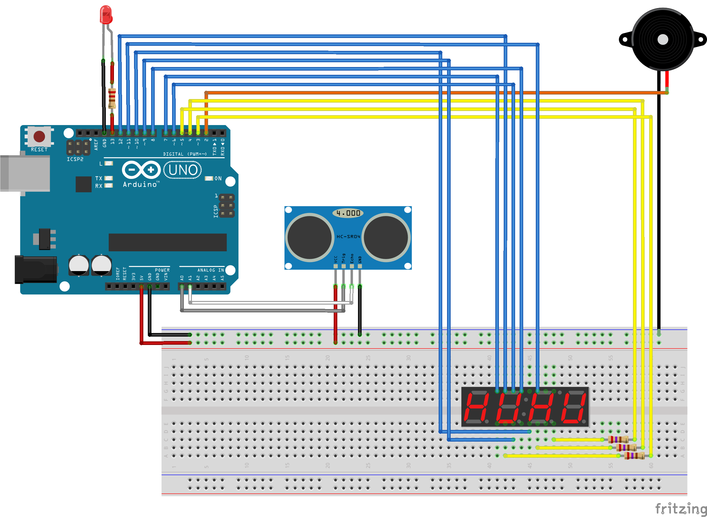

# Arduino distance speaker sevensegments
Use of an ultrasonic sensor HC-SR04 on an Arduino to measure distance with speaker and seven segments display

Libraries required:
- [NewPing](https://bitbucket.org/teckel12/arduino-new-ping/wiki/Home)
- [SevenSeg](https://github.com/sigvaldm/SevenSeg)
- [TimerFreeTone](https://bitbucket.org/teckel12/arduino-timer-free-tone/wiki/Home)

